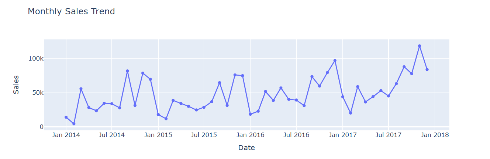
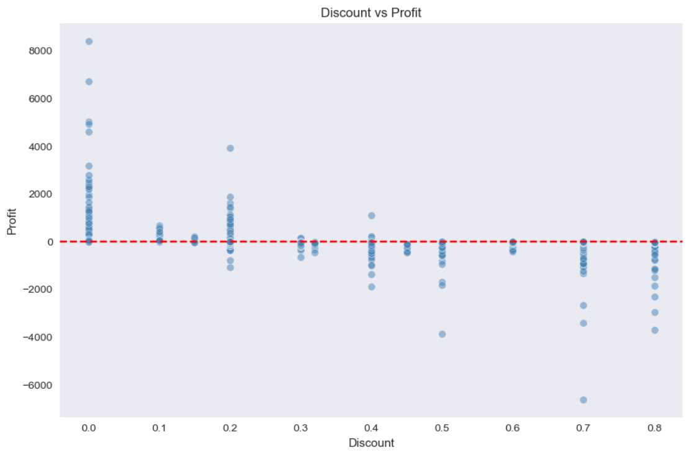
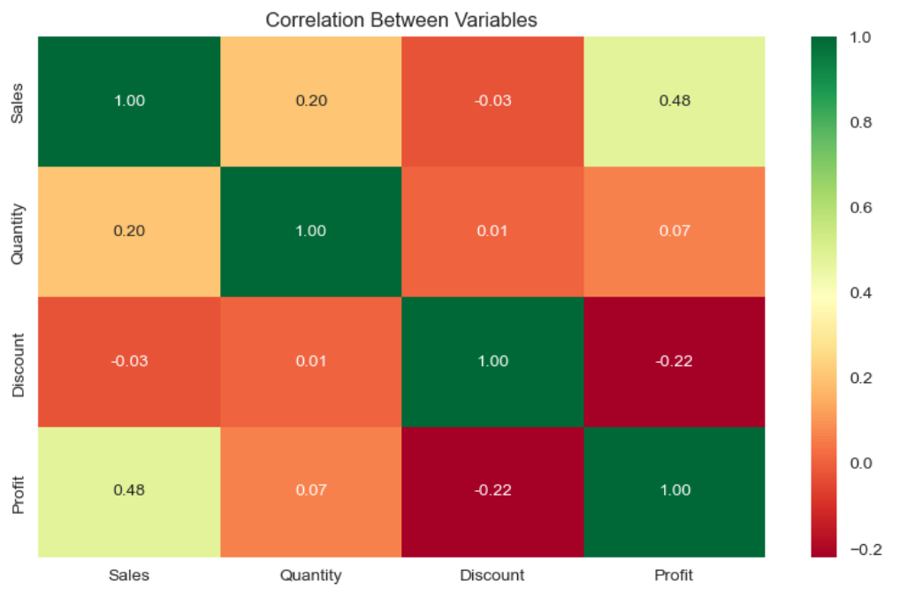
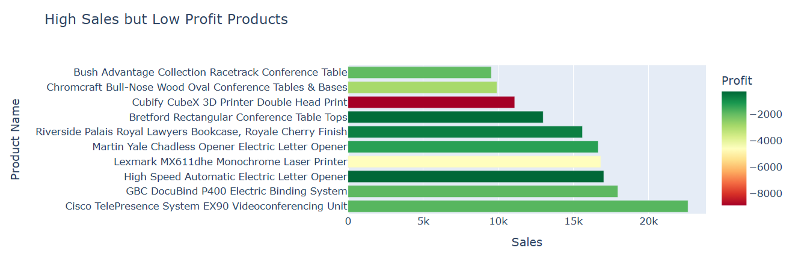
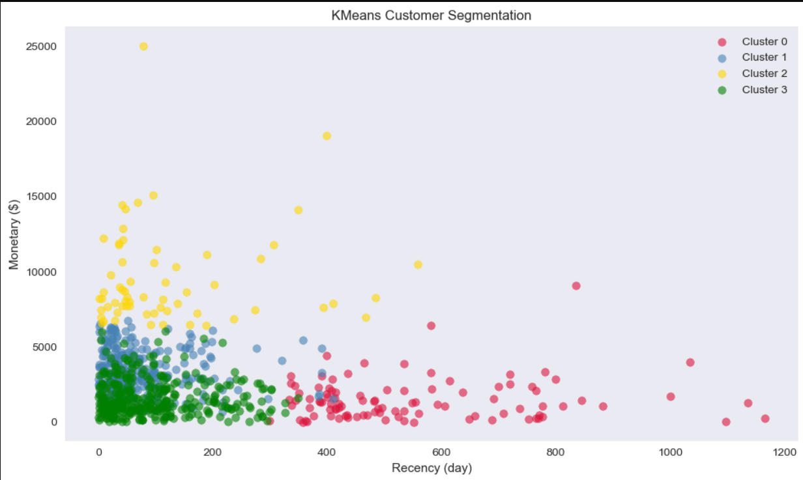
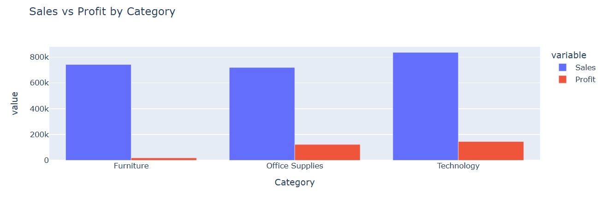
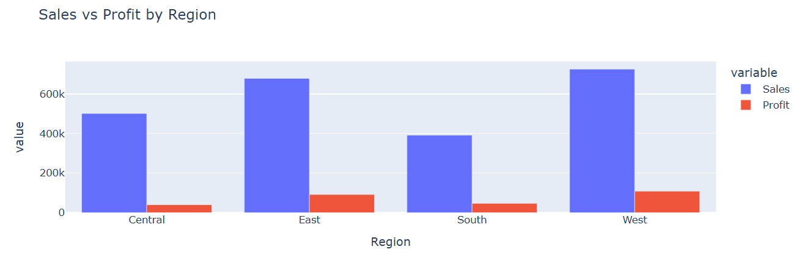

# Superstore Sales Analysis

## About
Analysis of US Superstore sales data (2014-2018) using Python.
The goal is to uncover sales trends, customer behavior, and unprofitable orders.

## Analysis Performed
- Exploratory Data Analysis (EDA)
- Sales & Profit Analysis
- Discount vs Profit Analysis
- Region & Category Analysis
- Customer Analysis (Top customers, Repeat vs One-time)
- RFM Analysis (Recency, Frequency, Monetary)
- KMeans Customer Segmentation
- Correlation Heatmap

## Key Insights
- 18.72% of orders are unprofitable.
- Discount above 30% usually results in loss.
- Technology is the most profitable category.
- West region leads in both sales and profit.
- 98.49% of customers made repeat puchases.
- Sean Miller is the top customer by sales but generates average loss of -$132 per order

## Tools & Libraries
- Python, Pandas, NumPy
- Matplotlib, Seaborn, Plotly
- Scikit-learn (KMeans)

## Dataset
- Source: [Kaggle Superstore Dataset](https://www.kaggle.com/datasets/vivek468/superstore-dataset-final)
- 9,994 orders | 21 columns | 2014-2018
## 📈 Visualizations

### Monthly Sales Trend

### Discount vs Profit

### Correlation Heatmap

### High Sales, Negative Profit Products

### KMeans Customer Segmentation

### Sales vs Profit by Category

### Sales vs Profit by Region
